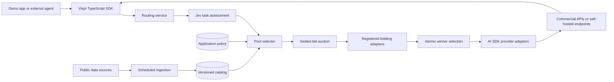

# Vispr demo specification

Status: implementation-ready proposal, September 29, 2026. Product decisions below reflect the design discussion; numerical defaults are adjustable starting values, not validated performance claims.

## Product and scope

Vispr is an inference marketplace accessed through a middleware SDK. A request is assessed by Jev, matched against a cached model catalog and application policy, auctioned among eligible provider deployments, and executed by the winner. The demo demonstrates all three parts: adaptive routing, provider competition, and registration by application builders and providers.

Real Jev decisions and real model responses are required. Provider bidding is simulated by registered adapters with configurable strategies. Commercial payment settlement is outside scope. Auction quotes are demonstration offers and must never be represented as discounts actually honored by upstream vendors.

Initial performance evidence comes exclusively from public benchmarks. Internal quality evaluations, learned routing, and feedback-based quality scoring are explicitly deferred. Operational telemetry for latency, usage, errors, and cost is included and is distinct from quality evaluation.

## Demo experience

The application contains five editable scenarios. Each supplies a prompt and initial policy; Jev still assesses the request rather than receiving a predetermined classification. Scenario labels do not force the winning model. Changing the prompt or policy can change the eligible pool and result.

| Scenario | Example | Initial quality/cost/latency weights | Evidence and capabilities |
| --- | --- | --- | --- |
| Support triage | Categorize a customer ticket and draft a concise response | 20/40/40 | Instruction following proxies, sufficient context, fast response |
| Invoice extraction | Convert supplied invoice text into a declared JSON schema | 60/30/10 | Structured output support; extraction or instruction-following evidence where available |
| Code debugging | Diagnose a failing function and propose a patch | 75/15/10 | Public coding results; reasoning configuration recorded |
| Research synthesis | Compare supplied documents and cite disagreements | 75/10/15 | Context capacity; public long-context or reasoning evidence where available |
| UI design and prototyping | Turn a product brief into a responsive landing page | 70/15/15 | Frontend/coding and instruction-following evidence; vision if references are attached |

Weights sum to 100 and are editable. No fixed provider is assigned to any scenario. A missing domain benchmark is visible as missing evidence, not silently replaced with an assertion of domain quality. General coding scores are labeled as proxies for design, not aesthetic measurements. The missing-coverage toggle may be necessary for some scenarios and must not be silently enabled.

Research uses bundled documents with stable citation identifiers. The design scenario generates a standalone HTML/CSS prototype rendered in a sandboxed iframe without access to application credentials or same-origin storage. JavaScript is disabled for the first design preview; interactive application generation is deferred.

### Screens

1. **Playground:** scenario picker, editable request, attachments supported by the selected adapters, policy selector, streamed response, usage and elapsed time. Design output also has preview/source tabs.
2. **Request trace:** assessment, confidence, policy/catalog versions, eligible and excluded models with reasons, bid arrival and expiry, scoring breakdown, winner, execution and any fallback. Timing separates classification, selection, auction, first token, and total duration.
3. **Application configuration:** application registration/API key issuance, saved policies, presets, limits, weights, pool size, disclosure settings and fallback controls. Secrets remain server-side.
4. **Provider console:** register endpoint and model offerings; configure bid strategy, rates, floor, capacity, simulated delay, and availability. Show adapter connectivity and recent requests.
5. **Catalog:** models and deployments, benchmark detail, source links, evidence coverage, pricing, latency provenance, refresh action and ingestion run history.

Demo access uses authenticated builder/operator roles within one demo organization. These roles demonstrate the two participation journeys without claiming a production multi-tenant marketplace.

## Architecture



Use a TypeScript monorepo with `apps/web` (Next.js), `packages/sdk`, `packages/routing`, `packages/catalog`, and `packages/providers`. Host the web UI and Node.js route handlers on Vercel. Use the Vercel AI SDK for provider calls and streaming where compatible; the Vispr auction remains the routing authority rather than adding an independent automatic model router.

Use managed PostgreSQL for catalog snapshots, application policies, participants, auctions, bids, usage, and trace events. Do not depend on process-local state surviving requests. Initial bidding adapters execute concurrently inside the bounded auction handler. Persist its deadline and state transitions. A conditional database update permits exactly one winner even under duplicate requests.

Vercel Cron triggers bounded, resumable catalog refresh batches. Set route duration limits to the selected deployment plan and use timeouts below those limits. No detached work after a function returns. Long-running ingestion can resume from stored cursors; a separate worker remains an extension point.

Local development runs the same services against a local database. Vercel does not host model weights: self-hosted inference runs on operator infrastructure. A deployed Vispr service needs a reachable authenticated endpoint; a loopback Ollama endpoint is usable only by a locally running service. Hosted deployment must not imply access to the user's laptop.

## Jev and pool construction

Jev receives the inference request context needed for classification and focused typed questions: task family, complexity, and semantic requirements. Explicit API features such as tool schemas, image inputs, requested output format, and context size are extracted in code. Jev confidence informs configurable fallback behavior.

Use independent Choice/Score/Noul questions as appropriate. Pin the Jev model version and question schema. Jev does not perform pricing arithmetic or invent model benchmark scores. TypeSafe recommends narrow judgments composed in code and documents numerical limitations.[1][2]

Selection proceeds as follows:

1. Validate the request and freeze the application policy and catalog snapshot for the run.
2. Assess task requirements with Jev; map task categories to a versioned public benchmark profile.
3. Filter deployments by authentication, availability, allowed provider/model lists, API features, context capacity, and required modalities.
4. Apply benchmark coverage, freshness and minimum quality rules. Default incomplete-coverage behavior is exclusion; enabling the toggle applies a configurable penalty and exposes unknowns.
5. Estimate execution cost and latency from cached rates, input-token estimates, configured output budget, and endpoint observations. Unknown quantities are explicit and follow policy. Cached prices are preliminary estimates; qualifying bids must pass limits again.
6. Rank candidates using normalized quality, cost, and latency utilities. Prefer the non-dominated frontier within the configured eligibility rules and cap the pool by policy. A configurable pool size/score band allows several competitive models to participate.
7. Invite registered deployments serving the selected models to bid. Preserve endpoint diversity where scores tie.

Quality utility is a weighted composite of comparable, task-relevant public results using benchmark-version-specific normalization. Retain raw scores and normalization rules. Do not average raw percentages, index values, and Elo ratings together. A benchmark score is a routing proxy, not a probability that the request will succeed. Missing evidence cannot satisfy an explicitly required benchmark threshold; the toggle permits missing optional profile evidence only.

For bids, compute `utility = wQuality * quality + wCost * costUtility + wLatency * latencyUtility - uncertaintyPenalty`. Utilities use fixed policy/reference bounds saved with the run, not changing min/max values of competing bids. Expose every term. An alternative mode uses cheapest qualifying bid after quality and latency thresholds. Ties resolve by estimated latency, then stable participant ID.

## Policy configuration

GUI and SDK serialize the same versioned policy. Include:

- Relative quality/cost/latency weights and optional cheapest-qualified mode.
- Minimum benchmark-derived quality; optional named benchmark minimums.
- Maximum estimated inference spend, output-token cap, and total run budget including Jev and retries.
- Latency metric selection (time to first token or estimated completion), target and request timeout.
- Provider/model allowlists and denylists; required capabilities.
- Incomplete benchmark coverage toggle (off initially), uncertainty penalty and evidence freshness.
- Maximum candidate pool size and score band.
- Bid visibility: dark or workload metadata; default dark.
- Auction deadline (initial demo default 300 ms), bid validity and late-bid handling.
- Low-confidence behavior: fail with a reason or use a configured conservative eligible pool.
- No-bid behavior: fail or direct-route to a qualifying configured fallback.
- Execution failure behavior: retry next valid bid within remaining budget, or fail.

Budget limits are enforced using conservative reservations and supported output caps; estimated cost is not a guarantee of an exact provider bill. Include separately billed reasoning/cache tokens when supported. When a reliable bound is unavailable, surface that limitation and allow strict policies to exclude the deployment. Latency targets filter estimates; actual deadlines require cancellation and may still incur upstream charges.

## Auction and provider contracts

An auction is one round of sealed bids. Providers cannot inspect competitors' offers. State transitions are `created -> bidding -> awarded -> executing -> completed`, with terminal `no_bid`, `failed`, or `cancelled` alternatives. Persist all transitions and request idempotency keys. Bids arriving after close, with wrong model IDs, invalid prices, expired validity, or unmet capability constraints are rejected.

**Dark invitation:** opaque auction ID, provider-specific eligible offering IDs, deadline, and protocol version. No prompt, semantic class, benchmark scores, private app weights, or user identity. Providers can quote input/output unit rates without knowing workload. The router uses private workload estimates to compare those rates.

**Optional metadata invitation:** additionally exposes configured token buckets, duration estimate or service tier. Do not include a generated prompt summary. Only the winner receives the inference payload; Jev and the trusted routing service necessarily see classification context.

**Bid:** participant/offer/model IDs, USD input and output rates, any supported extra charge rates, declared queue delay, estimated throughput, validity, and capacity reservation token. Promises are labeled provider-declared; cached observed latency remains visible and can be preferred by policy.

Initial adapter strategies are fixed rate, capacity-adjusted, and bounded discount. All respect configured floors. Capacity acquisition/release is atomic, with expiring reservations and cleanup. Seeded bid simulation supports repeatable walkthroughs while live inference remains variable.

Provider registration supports OpenAI, Anthropic, Google, a configurable hosted open-model provider, and generic OpenAI-compatible endpoints (e.g. operator-run vLLM/Ollama). Register model version, context/output limits, supported features, endpoint, secret reference, deployment configuration, and bid policy. Probe declared protocol features rather than assuming every compatible endpoint supports tools, streaming, images, or structured output.

Registered network destinations require authenticated operator control; validate URLs and restrict unintended private-network access in hosted mode. Local mode can explicitly allow loopback/private endpoints. Never expose provider credentials to the browser, SDK consumer, trace, or auction competitors.

## Repeatable model catalog

The initial automated connector is Artificial Analysis's model data API. It provides benchmark, pricing and speed fields; it requires an API key, caching, attribution and compliance with source terms.[3] This is a bootstrap connector, not a claim that one source covers all public benchmarks.

Provide an additional reusable JSON/CSV benchmark connector with configured source URL or operator-uploaded artifact, schema mapping, benchmark version and source attribution. Sources without reliable supported feeds use versioned imports explicitly labeled manual. A URL connector runs on schedule; manual files remain manual. Model/provider discovery adapters reconcile available inference IDs where supported, and operator registrations cover self-hosted deployments. Unknown model aliases require review rather than fuzzy merging automatically.

### Refresh algorithm

1. Daily scheduled trigger and manual action invoke the same ingestion command with a durable run ID.
2. Acquire a source lock; fetch with conditional requests when supported, bounded retries/backoff and pagination/cursors.
3. Retain source URL, retrieval time, content hash, adapter version and raw payload where source terms permit.
4. Validate schema, units, ranges, model identity and evaluation configuration. Quarantine bad rows and ambiguous aliases.
5. Normalize into model versions, benchmark observations and deployment-level rates/latency. Keep provider claims distinct from independently measured data.
6. Upsert by stable source record identity plus version/configuration. An unchanged import creates no duplicate observations or unnecessary new catalog snapshot.
7. Publish a validated snapshot atomically. Preserve the last good snapshot on failure. Mark missing/discontinued records stale; never infer immediate deletion from a partial response.
8. Save counts, changes, warnings, source freshness and retry status. The GUI shows added, changed, rejected and unchanged records.

Refresh discovery/prices daily initially; refresh public benchmark data daily using source caching. Update endpoint latency from ordinary completed demo requests, with sample count, time window and workload context. Do not claim these measurements are quality evaluations. Fallback to public or provider-declared latency when local samples are insufficient and label the source. Do not transfer one host's measured latency to another host serving the same weights.

Model identity includes creator, family, version and aliases. Evaluation records retain reasoning mode and relevant quantization/harness details when available. A self-hosted quantized variant does not automatically inherit exact full-precision benchmark results: inherited evidence is labeled a proxy and subject to incomplete-coverage policy.

### Core records

- ModelVersion; Provider; Deployment; CapabilityDeclaration.
- BenchmarkDefinition; BenchmarkObservation; PriceObservation; LatencyObservation.
- Source; IngestionRun; AliasMapping; CatalogSnapshot.
- Application; APIKeyHash; PolicyVersion; ProviderSecretReference.
- InferenceRequest; TaskAssessment; CandidateDecision; Auction; Bid; Award; TraceEvent; UsageRecord.

Every request links its policy, assessment schema and catalog versions so its selection arithmetic can be reproduced after refreshes. Store trace metadata by default; storing full prompt/response content is separately configurable.

## SDK and service boundary

The demo uses the same SDK exposed to external applications. The first integration target is TypeScript/JavaScript; Python and universal drop-in API compatibility are future extensions.

```ts
const vispr = new Vispr({ apiKey: process.env.VISPR_API_KEY });
const run = await vispr.inference.stream({
  policyId: 'balanced',
  messages,
  maxOutputTokens: 1500,
  idempotencyKey: requestId,
});
for await (const event of run.events) {
  // Typed status, trace, text/tool deltas, usage, completion or error.
}
```

Support text streaming, message history, tool definitions and schema-constrained outputs where the elected deployment supports them. Tool execution remains in the consuming application; subsequent model turns can route again. Capability filtering prevents selecting an endpoint that cannot handle the request. Cancellation propagates upstream. No automatic replay of partial streamed responses or tool actions after failure; the client gets an explicit partial/failure event.

Service routes cover inference/streaming and cancellation, request trace retrieval, application/policy management, provider/deployment registration, catalog browsing, manual refresh, and authenticated scheduled refresh. SDK keys are scoped to an application; provider operations require operator credentials.

## Failure behavior and observability

Show Jev unavailability/low confidence, no eligible models, missing evidence, auction timeout, no acceptable bids, provider error, and interrupted streaming distinctly. No silent relaxation of hard limits. Fallbacks are policy decisions recorded in the trace, and consume the remaining budget. Do not switch providers after output is exposed without an explicit new client request.

The run summary separates simulated auction quote, estimated upstream cost, usage-derived upstream cost, and any unavailable actual billing data. Report measured classification/auction overhead and inference latency without promising an unmeasured target. Latency estimates include their timestamp and origin.

## Implementation milestones and acceptance

1. **Foundation and catalog:** Next.js/Vercel scaffold, database migrations, catalog schema, Artificial Analysis connector, generic import connector, refresh history and atomic snapshots. Acceptance: importing identical data twice is idempotent; a malformed refresh leaves the last valid snapshot intact.
2. **Routing:** Jev integration, versioned task/benchmark profiles, policy editor and candidate trace. Acceptance: changing hard limits changes eligibility; missing coverage obeys the toggle; incompatible modalities/schema/tool requirements never pass.
3. **Marketplace:** provider registration, commercial and open/self-hosted adapters, bidding strategies, deadline and atomic award. Acceptance: late bids fail; concurrent award attempts yield one winner; payloads disclosed to losing bidders contain no prompt or semantic classification.
4. **Live SDK path:** SDK streams actual elected model output with cancellation and usage. Acceptance: all configured commercial families and at least one reachable open-model deployment can complete a request; registration offers connectivity diagnostics. Missing credentials are explicit, never replaced with fake responses.
5. **Demo experience:** five scenarios, trace, design preview, presets and deployment configuration. Acceptance: each scenario completes through the SDK; policy changes can alter pool/winner without hardcoded winners; catalog refresh works from both manual and scheduled triggers.

Use deterministic fixtures for routing, ingestion and auction contract tests; these are engineering correctness tests, not the deferred internal model-quality evaluation suite. Live smoke tests require real credentials and a small explicit usage budget. Do not call an unexecuted integration verified.

## Deferred

Internal model-quality evaluations; automated quality learning; real commercial auctions/settlement; production tenant isolation and billing; remote third-party bidding-service protocol rollout; private-network relay agents; custom model training; native Python SDK; broad multimodal generation; interactive generated-app execution.

## Setup dependencies

Implementation can proceed without further product input. A live deployed demo eventually needs Vercel/project access, PostgreSQL, a Jev key, an Artificial Analysis key, real inference provider credentials, and a reachable open/self-hosted endpoint. Provision or request these at the relevant milestone. Never embed secrets or substitute fabricated live results.

## Sources checked

1. [TypeSafe primitives and composition](https://docs.typesafe.ai/introduction) and [intent routing](https://docs.typesafe.ai/patterns/intent-routing).
2. [Jev documented limitations](https://docs.typesafe.ai/model-jaggedness/jev-1.13).
3. [Artificial Analysis data API](https://artificialanalysis.ai/api-reference).
4. [Vercel Cron management](https://vercel.com/docs/cron-jobs/manage-cron-jobs): secure the scheduled route and account for function duration limits.
5. [AI SDK OpenAI-compatible providers](https://ai-sdk.dev/providers/openai-compatible-providers): adapter foundation for compatible endpoints.
